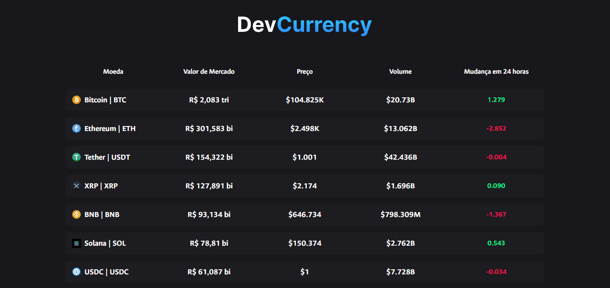

# DevCurrency - Cryptocurrencies 💰

DevCurrency is a web application that provides real-time information on changes in the market value of all cryptocurrencies on the market, providing details of each currency in an organized and detailed manner.

---

## Features 📋

- **Coin**: The current cryptocurrency.
- **Market Value**: The current market value converted to BRL.
- **Price**: It shows the current market value of the cryptocurrency in USD.
- **Volume**: Total traded value of a cryptocurrency in the 24 hours.
- **Change**: Reveals whether the cryptocurrency has seen a rise or fall in value in the last 24 hours.

---

## Technologies 💻

- **React**: A JavaScript library used for user interface.
- **React Router**: Routing management in the application.
- **TypeScript**: A strongly typed programming language that builds on JavaScript.
- **Vite**: Build and development tool for front-end projects to provide a faster and more efficient development experience

---

## Installation & Setup 🔧

Make sure you've installed:

- **Node.js** (v14 or higher)
- **npm** or **yarn**

### Steps to run the project locally 📌

1. Clone the repository

  ```bash
  git clone https://github.com/dorfmam/react-cryptocurrency.git
  cd react-cryptocurrency
  ```

2. Install dependencies

  ```bash
  npm install or yarn install
  ```

3. Start the development server

  ```bash
<<<<<<< HEAD
  npm start or yarn start
=======
  npm run dev or yarn dev
>>>>>>> 4d4a1ad (new GIF file added to 'assets' file)
  ```

The application will be available at `http://localhost:5173`

### Project Demo 🎬



---

## Project Structure 📂

  ```bash 

  cripto-app/
    ├── node_modules/
    ├── public/
    ├── src/
    │   ├── assets/
    │   ├── components/
    │   │   ├── Header/
    │   │   └── Layout/
    │   ├── pages/
    │   │   ├── Home/
    │   │   └── NotFound/
    │   ├── App.tsx
    │   ├── index.css
    │   ├── main.tsx
    │   ├── router.tsx
    │   └── vite-env.d.ts
    ├── .gitignore
    ├── eslint.config.js
    ├── index.html
    ├── package-lock.json
    ├── package.json
    ├── README.md
    ├── tsconfig.app.json
    ├── tsconfig.json
    └── tsconfig.node.json
  ```

---

## Contributions 👥

Feel free to contribute! To contribute:

1. **Fork the repository**
2. **Create a feature branch:**

  ```bash
  git checkout -b new-feature
  ```
3. **Commit your changes:**

  ```bash
  git commit -m "Adding a new feature"
  ```
4. **Push to the remote repository:**

  ```bash
  git push origin new-feature
  ```
5. Open a Pull Request

---

- Author: [Caio Dorfmam](https://github.com/dorfmam/main)
